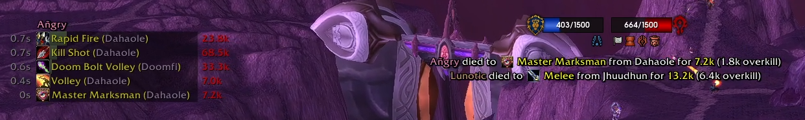
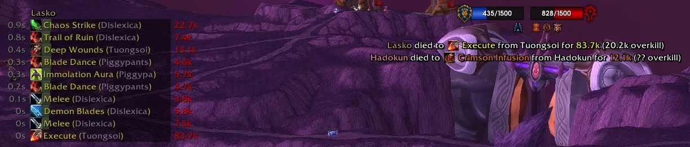
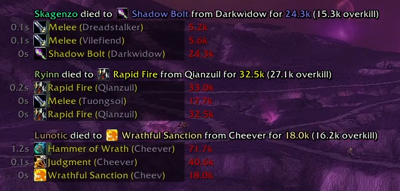

# DeathLogWA

DeathLogWA is a weak aura that shows summary data when a party member dies in game. 

Death summary text and bars are the two main components of the weak aura and combinations of these two define the possibile use cases.

## Death summary text
Shows the player, spell, spell type, and overkill:

## Death summary bars
Shows individual damage events leading up to the party member's death. It includes the time when the damage was taken relative to the death, the ability name, the name of the source of the damage, the amount of damage, and (optionally) the overkill ammount.

# Instructions for use
## Default setup
By default the weak aura is imported in a configuration with the summary text on top of the screen and the summary bars on the left of the screen. These can be moved, recolored, or resized to your liking. It will show up to 5 summary text events and 1 set of summary bars by default.

## Adding more death events
You can increase the number of summary text events by increasing the bar limit in the weak aura dynamic group (default: 3).

You can increase the number of sets of summary bar events by increasing the "Number of Deaths to Show" option in custom options (default: 1).

## Incorporating summary text with summary bars
Optionally, you can set the summary text to show above the bars instead of in it's own separate aura. 
To set this you you should uncheck "Display Death Summary Separately" and check "Display Death Summary on Bars"

## Simple player name death alert
Set this up by turning off all the features except the simple player name.

# Additional options and features
- You can toggle on/off HP parsing for the summary bars. When this is off, there is a small improvement in weak aura performance.
- You can toggle on/off the overkill amount on either bars or the summary text
- You can change the number of bars shown per death (default: 5)
- You can set the padding between summary bars
- You can optionally remove space between sets of death event summary bars (default: active)
- You can include ONLY player (your) death events - and exclude all other players

# Caveats and implementation details
The motivation for this weak aura came from watching the [Mythic Dungeon Invitational (youtube link)](https://youtu.be/nkAaYdJJ2bw?t=868) and seeing their death alert. I mostly cloned this and added some of my own features. The bars were easy to implement after doing all the work for the text notification, so I went ahead and added those in as well. 

This weak aura contains two dynamic groups. One for the separate summary text and one for the bars. The "Bars" aura contains all the logic and settings for the weak aura. The logic utilizes a majority of the "COMBAT_LOG_EVENT_UNFILTERED" events and the "UNIT_DEATH" event. Outside of the "Bars" weak aura, all data are passed to them in custom events. As a consequence, the aura only ever parses the combat log events one time - which helps with perforamnce.

On my performance profiling, this weak aura did not use any more resources than a typical talent tracker or interrupt bar tracker. I do encourage you to check for yourself. Just type /wa pstart -> /wa pstop -> /wa pprint to show profile your weak auras - it's quite easy to do and can be insightful.

# Feedback and contribution
This is quite a complex implementation, and I'm sure there are still many bugs despite my best efforts. I'll be maintaining this weak aura actively for some time and am happy to take suggestions, feedback, or contributions. You can leave an issue on the github page, message me in game @Coupmd-Thrall, or fine me online at twitch.tv/coupmd.